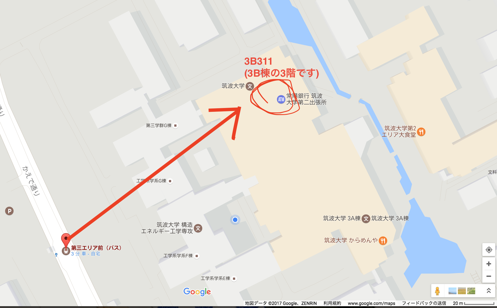

# つくば周辺環境ガイド for 外部生

## 筑波大学のenPiTの教室へのアクセス方法

### つくば駅のバスターミナル→最寄りのバス停

- 筑波大学の教室の最寄りバス停は「第3エリア前」です。
- [つくばセンターバスのりば](http://kantetsu.jorudan.biz/?p=d&m=a&b1=%E3%81%A4%E3%81%8F%E3%81%B0%E3%82%BB%E3%83%B3%E3%82%BF%E3%83%BC&v=)を参考にして、「筑波大学 循環右回り」のバスに乗ってください。
- 路線図もを参考にしてください。
  - [関東鉄道 バス路線図](http://www.tsukuba.ac.jp/access/pdf/131029campusbus_route.pdf)

### 最寄りのバス停→教室

- 教室は、第3エリアにある3B棟の3B311号室です。
- 「B」と書かれた建物の3階にあります。
- 迷ったときは、近くの親切な筑波大学生に尋ねましょう。
- 

## つくばでのオススメの買い物先

### リアル店舗

- スーパーセンタートライアル つくば学園都市店

  - Google Map

    https://www.google.co.jp/maps/place/%E3%82%B9%E3%83%BC%E3%83%91%E3%83%BC%E3%82%BB%E3%83%B3%E3%82%BF%E3%83%BC%E3%83%88%E3%83%A9%E3%82%A4%E3%82%A2%E3%83%AB+%E3%81%A4%E3%81%8F%E3%81%B0%E5%AD%A6%E5%9C%92%E9%83%BD%E5%B8%82%E5%BA%97/@36.0959427,140.0869554,15z/data=!4m5!3m4!1s0x0:0xd37db2ffd80f20a3!8m2!3d36.0959427!4d140.0869554
  - 説明

    食料品や生活用品、文具から衣服類まで幅広く取り扱うスーパーです。

### ネット店舗

  - Amazon

    - https://www.amazon.co.jp/
    - つくば市には専門店が少ないですが、コンビニエンスストアがいたるところにあるので、コンビニ受け取りを利用するととても便利です。
